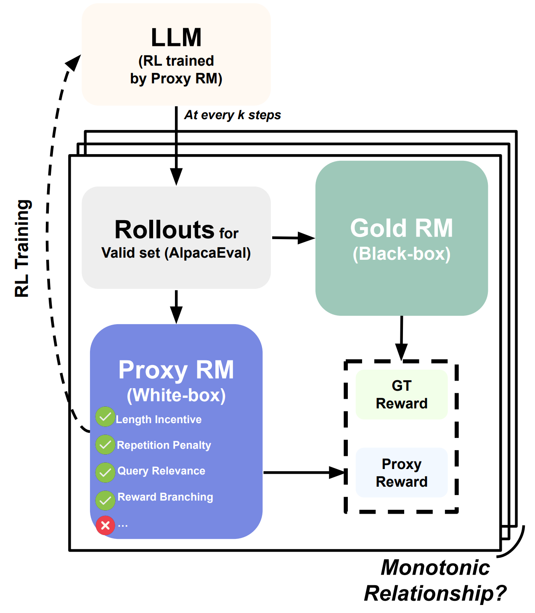

# Rethinking the Role of Proxy Rewards

This code is official implementation of "[Rethinking the Role of Proxy Rewards in Language Model Alignment](https://arxiv.org/abs/2402.03469)" accepted at EMNLP 2024. <br>
In this paper, we aim to figure out what’s the matter to replicate the black-box "gold" reward signals with several white-box features! 💪 <br>
We call this study as 🍀 "Reverse Reward Engineering"! 🍀


<p align="center">
    
</p>

The Reverse Reward Engineering consists of the below three steps. <br>

1. Devise interpretable reward function (as a Proxy), e.g., response length
2. PPO training against the proxy reward function
3. Check monotonic relationship between the proxy and gold rewards on the validation set as training progresses (every k steps)


## Setup

* Requires python>3.10

```
python -m venv rer
source rer/bin/activate
pip install -r requirements.txt
```

## 🔥 PPO Training with Reverse-Engineered White-box Reward Fuction 🔥

To reproduce our experiments, you should obtain the same AlpacaFarm SFT backbone. <br>
Please follow [this instruction](https://github.com/tatsu-lab/alpaca_farm#downloading-pre-tuned-alpacafarm-models) to obtain the model weight.

### White-box features

- length_incentive: Activate Length Incentive (LI) for the reward
- repetition_penalty: Activate Repetition Penalty (RP) for the reward
- relevance_scaling: Activate Query/Reference Answer Relevance (QR/RAR) for the reward
- reward branching: Activate Reward Branching according to Query Type.
   - Note that `qtype=(OPENENDED|CONSTRAINED)` and `reference` should be annotated for each instance of training/validation.
   - Please see `data/alpacafarm_train.json`

* You can design your own white-box features! Please see `ReversedEngineeredRewardForInference` class in the `reward_model.py`.

```
EXP_NAME=alpaca_test
OUTPUT_DIR="."

MODEL_NAME=alpacafarm-sft10k/sft10k  # Specifiy your AlpacaFarm SFT backbone path or Huggingface model name
DATASET_PATH="data/alpacafarm_train.json"
DEV_PATH="data/alpacafarm_val.json"

length_incentive=true
repetition_penalty=true
relevance_scaling=true
reward_branching=true

config=configs/zero2-bf16.yaml

accelerate launch --num_machines 1 --num_processes 1 --config_file $config run_ppo.py \
  --exp_name=$EXP_NAME \
  --model_name=$MODEL_NAME \
  --overall_steps=10000 \
  --seed=42 \
  --save_freq=500 \
  --output_dir=${OUTPUT_DIR}/${EXP_NAME} \
  --cache_dir=$CACHE_DIR \
  --dataset_path=$DATASET_PATH \
  --dev_prompt_path=$DEV_PATH \
  --logging_dir=${OUTPUT_DIR}/${EXP_NAME}/logs \
  --output_max_length=512 \
  --batch_size=16 \
  --mini_batch_size=2 \
  --gradient_accumulation_steps=4 \
  --learning_rate=1e-5 \
  --lora_r=8 \
  --lora_alpha=16 \
  --lora_dropout=0.05 \
  --reward_model_batch_size 8 \
  --length_incentive=$length_incentive \
  --repetition_penalty=$repetition_penalty \
  --relevance_scaling=$relevance_scaling \
  --reward_branching=$reward_branching \
```

## Evaluation


### 🍀 Reverse Reward Engineering 🍀 (Check Monotonicity between proxy and gold rewards)

#### 1. Obtain Rollouts with each checkpoint

```
DIR_PATH_TO_SAVED_PEFT_MODELS="." # OUTPUT_DIR
EXP_NAME=alpaca_test
base_model_name=alpacafarm-sft10k/sft10k  # Specifiy your AlpacaFarm SFT backbone path or Huggingface model name

for peft_model_name in "${EXP_NAME}_step_500 ${EXP_NAME}_step_1000 ${EXP_NAME}_step_1500 ${EXP_NAME}_step_2000 ${EXP_NAME}_step_2500 ${EXP_NAME}_step_3000 ${EXP_NAME}_step_3500 ${EXP_NAME}_step_4000 ${EXP_NAME}_step_4500 ${EXP_NAME}_step_5000"

do
    python evaluation.py \
      --base_model_name=$base_model_name \
      --peft_model_name="${DIR_PATH_TO_SAVED_PEFT_MODELS}/${peft_model_name}" \
      --baseline_model_file=$baseline_model_file \
      --batch_size=16 \
      --evaluations alpaca
done

```

#### 2. Reward scoring and check monotonicity (SpearmanR)

On the all rollouts for every 500 step, we evaluate the success of the reverse reward engineering with the monotonicity of reward scores between proxy and gold RMs. <br>
To this end, you can run the below scripts.

```
DIR_PATH_TO_SAVED_PEFT_MODELS="." # OUTPUT_DIR
base_model_name=alpacafarm-sft10k/sft10k  # Specifiy your AlpacaFarm SFT backbone path or Huggingface model name

python eval_monotonicity.py \
  --output_dir=${DIR_PATH_TO_SAVED_PEFT_MODELS} \
  --model_prefix=${EXP_NAME} \
```

SpearmanR between proxy (RER) and gold (StarlingRM-34B) RMs will be returned.

`SignificanceResult(statistic=0.9545454545454544, pvalue=0.0016368033159867143)`

### Others

#### 1. AlpacaEval

After generating rollouts with the above `evaluation.py` script, run the below script to compute the win rate (AlpacaEval 1.0). <br>

Please set your openai api key as an enviroment variable.

`export OPENAI_API_KEY=SPECIFY_YOURS`


```
export IS_ALPACA_EVAL_2=False
export MODEL_OUTPUT_PATH=${DIR_PATH_TO_SAVED_PEFT_MODELS}/${EXP_NAME}_step_5000/alpaca-eval-${EXP_NAME}_step_5000.json

alpaca_eval --annotators_config alpaca_eval_gpt4 --model_outputs ${MODEL_OUTPUT_PATH}  --is_overwrite_leaderboard
```

#### 2. SuperNatural-Instruction

To check the alignment tax, we evaluate the models on the [SuperNatural-Isntruction](https://arxiv.org/abs/2204.07705). <br>

First, clone the dataset as follow.

```
cd data
git clone https://github.com/allenai/natural-instructions
```

Then, run the below script.

```
DIR_PATH_TO_SAVED_PEFT_MODELS="." # OUTPUT_DIR
base_model_name=alpacafarm-sft10k/sft10k
peft_model_name=alpaca_test_step_5000

python evaluation.py \
  --base_model_name=$base_model_name \
  --peft_model_name="${DIR_PATH_TO_SAVED_PEFT_MODELS}/${peft_model_name}" \
  --baseline_model_file=$baseline_model_file \
  --batch_size=16 \
  --evaluations superni
```

## Citation

```bibtex
@inproceedings{kim2024rethinking,
  title={Rethinking the Role of Proxy Rewards in Language Model Alignment},
  author={Kim, Sungdong and Seo, Minjoon},
  booktitle={EMNLP},
  year={2024}
}
```

## License
```
Rethinking-Proxy-Reward
Copyright (c) 2024-present NAVER Cloud Corp.

Licensed under the Apache License, Version 2.0 (the "License");
you may not use this file except in compliance with the License.
You may obtain a copy of the License at

    http://www.apache.org/licenses/LICENSE-2.0

Unless required by applicable law or agreed to in writing, software
distributed under the License is distributed on an "AS IS" BASIS,
WITHOUT WARRANTIES OR CONDITIONS OF ANY KIND, either express or implied.
See the License for the specific language governing permissions and
limitations under the License.
```
